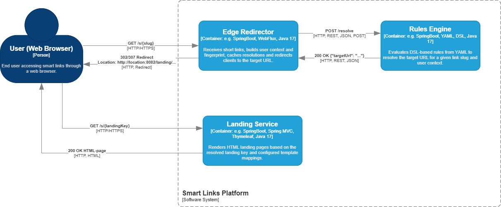

# Smart Links (multi-module)

“Smart Links” monorepo.

## Architecture



The system consists of three microservices:

- **edge** — receives a short link and request parameters, builds a user “fingerprint”, caches the result, and calls the rules engine.
- **rules** — based on a set of attributes (browser, device, time, language, etc.) and a YAML-based DSL config, decides which URL the user should be sent to.
- **landing** — renders HTML pages (landings) by the slug that the edge service redirected to.


### Client request processing flow

1. The client opens `http://localhost:8080/s/sale1111` (Edge).
2. Edge collects `RequestContext` (headers, demo headers `X-Demo-*`, query parameters), builds a fingerprint, and checks the cache.
3. If there is no cache — Edge calls Rules (`POST http://localhost:8081/resolve`) with the `slug` and attributes.
4. Rules reads the DSL in `rules.yaml`, selects the matching rule, and returns `targetUrl`.
5. Edge performs an HTTP redirect to `targetUrl` (usually `http://localhost:8082/landing/...`).
6. Landing returns the required HTML template.

## Repository structure

```text
smart-links/
  pom.xml                  # parent, multi-module
  edge/
    pom.xml
    src/...
    README.md
  rules/
    pom.xml
    src/...
    README.md
  landing/
    pom.xml
    src/...
    README.md
```

## Build and run with Docker

### Prerequisites

- Docker / Docker Desktop is installed
- Docker Compose is installed (bundled with Docker Desktop)
- Ports `8080`, `8081`, `8082` are free

### Startup steps

Open a terminal (PowerShell / bash) and run:

```bash
# 1. Go to the project root (where the parent pom.xml and docker-compose.yml are located)
cd /path/to/project/root

# 2. Build all three microservices and their JAR files
mvn clean package

# 3. Build Docker images for edge, rules, and landing
docker compose build

# 4. Start all microservices in Docker (foreground)
docker compose up