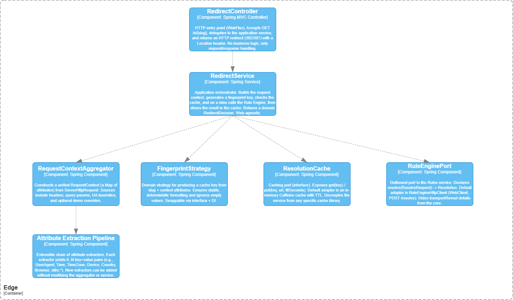

# Smart Links — Edge Redirector Service

## Архитектура



Edge-сервис принимает входящие запросы по адресу `/s/{slug}`, собирает контекст пользователя из HTTP-заголовков и query-параметров, строит отпечаток (fingerprint) и сначала проверяет локальный кэш.  
Если в кэше нужного ключа нет, сервис вызывает Rules Service (`POST /resolve`), сохраняет результат в кэш и возвращает клиенту HTTP-редирект (`302` или `307`) на целевой landing-URL.

Основные компоненты:
- **RedirectController** — точка входа `/s/{slug}`, вызывает бизнес-логику и формирует ответ с редиректом.
- **DefaultRedirectService** — оркестрирует сбор контекста, вычисление fingerprint, обращение к кэшу и вызов Rules Service.
- **RequestContextAggregator** — собирает `RequestContext` из HTTP-запроса через цепочку экстраторов атрибутов.
- **AttributeExtractor*** — небольшие расширяемые компоненты, извлекающие отдельные атрибуты (браузер, устройство, время, язык и т.д.) из заголовков и параметров.
- **FingerprintStrategy** — превращает slug + контекст в стабильный ключ кэша.
- **ResolutionCache (Caffeine)** — in-memory кэш сопоставлений (slug + контекст → URL).
- **RuleEnginePort / RuleEngineHttpClient** — абстракция и HTTP-клиент для вызова Rules Service.

## Паттерны проектирования и SOLID

- **Strategy**
  - `FingerprintStrategy`, `BrowserDetector` и `AttributeExtractor` реализуют разные стратегии построения ключа и извлечения атрибутов.
  - Через DI и интерфейсы выполняются **DIP** и **OCP** — реализацию можно заменить без изменения вызывающего кода.

- **Chain of Responsibility / Pipeline**
  - `RequestContextAggregator` последовательно запускает список `AttributeExtractor`-бинов.
  - Добавление нового атрибута — это просто новая реализация `AttributeExtractor`, существующий код не меняется (**SRP**, **OCP**).

- **Port/Adapter**
  - `RuleEnginePort` — порт взаимодействия с Rules Service, `RuleEngineHttpClient` — адаптер поверх `WebClient`.
  - Высокоуровневый код не знает о деталях HTTP и зависит от абстракции (**DIP**).

- **Абстракция над кэшем**
  - `ResolutionCache` скрывает детали реализации кэша (Caffeine).
  - Легко заменить реализацию или отключить кэширование, не трогая бизнес-логику.

## Технологии

В Edge-сервисе используются:

- **Java 17**
- **Spring Boot 3 (WebFlux)** — реактивный HTTP-стек
- **Reactor / Mono** — реактивные типы
- **Caffeine** — высокопроизводительный in-memory кэш
- **Spring Boot Test, JUnit 5, Mockito** — модульное тестирование
- **JaCoCo** — анализ покрытия тестами
- **Maven** — сборка и управление зависимостями

## Как запустить сервис

Требования: JDK 17, Maven.

```bash
mvn clean package
mvn spring-boot:run
```

## Тестирование через синтетические заголовки (X-Demo-*)

Для демонстрации работы правил без необходимости реально менять браузер, устройство или время, Edge-сервис понимает набор **синтетических заголовков** `X-Demo-*`. Они перекрывают значения, автоматически извлекаемые из обычных заголовков и системного времени, и попадают в `RequestContext`.

Поддерживаемые заголовки:

- `X-Demo-Browser` → атрибут `browser`  
  Примеры значений: `Chrome`, `Firefox`, `Safari`.
- `X-Demo-Device` → атрибут `device`  
  Примеры: `desktop`, `mobile`, `tablet`.  
  При отсутствии — используется `desktop`.
- `X-Demo-Time` → атрибут `time` (локальное время пользователя)  
  Формат: `HH:mm`, например: `10:30`, `21:05`.  
  При отсутствии берётся текущее время с сервера.
- `X-Demo-Tz` → атрибут `tz` (таймзона пользователя)  
  Примеры: `UTC`, `Europe/Amsterdam` и т.п.  
  При отсутствии — `UTC`.
- `X-Demo-Geo` → атрибут `country`  
  Примеры: `NL`, `RU`, `US` или любое строковое обозначение региона.  
  При отсутствии — `UNKNOWN`.

Дополнительно Edge-сервис забирает все query-параметры вида `attrs.*` в отдельные атрибуты без префикса:  
`?attrs.segment=premium&attrs.campaign=BLACKFRIDAY` → `segment=premium`, `campaign=BLACKFRIDAY`.

### Примеры вызовов

**Через curl:**

```bash
curl -v "http://localhost:8080/s/sale1111" \
  -H "X-Demo-Browser: Chrome" \
  -H "X-Demo-Device: desktop" \
  -H "X-Demo-Time: 10:00" \
  -H "X-Demo-Tz: Asia/Kolkata" \
  -H "X-Demo-Geo: IN"