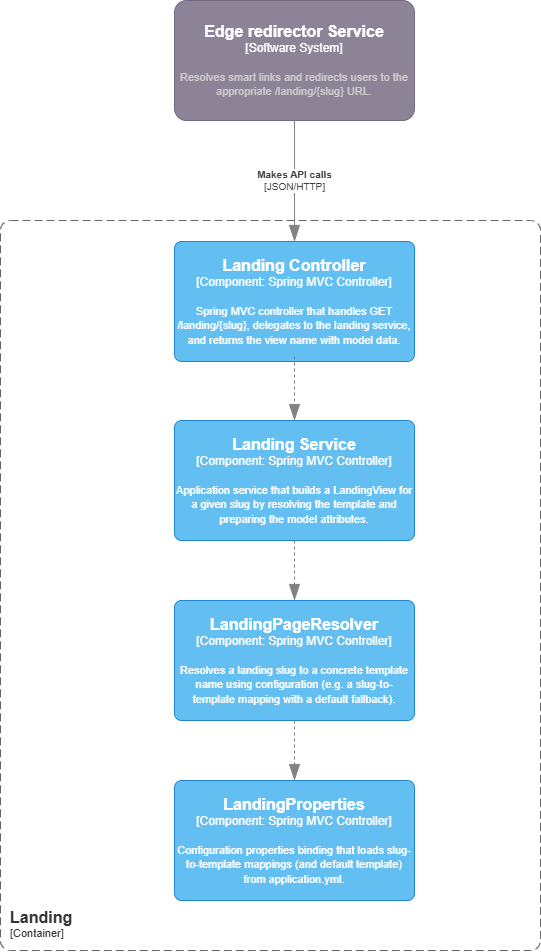

# Smart Links — Landing Service

## Архитектура



Landing Service отвечает за отдачу HTML-страниц по разрешённым ссылкам.  
После того как Edge Redirector и Rules Service определили целевой URL, пользователь попадает на `/landing/{slug}`. Контроллер вызывает сервис, который определяет имя шаблона и подготавливает модель, а Spring MVC View Engine рендерит HTML-страницу.

Основные компоненты:
- **LandingController** — обрабатывает `GET /landing/{slug}`, вызывает `LandingService`, наполняет `Model` и возвращает имя шаблона.
- **LandingService / DefaultLandingService** — бизнес-логика выбора шаблона и подготовки `LandingView` (имя шаблона + модель).
- **LandingPageResolver / ConfigLandingPageResolver** — резолвит slug в конкретный шаблон с fallback на значение по умолчанию.
- **LandingProperties** — связывает настройки из `application.yml` (карта slug → template + default template) с Java-классом.
- **LandingView** — DTO с `templateName` и набором атрибутов модели.

## Паттерны проектирования и SOLID

- **Strategy для выбора лендинга**  
  - `LandingPageResolver` — интерфейс, `ConfigLandingPageResolver` — реализация на основе конфигурации.  
  - Для более сложной логики (A/B-тесты, персонализация) можно внедрить другую стратегию, не трогая контроллер и сервис (**DIP**, **OCP**).

- **Service + ViewModel (LandingView)**  
  - `DefaultLandingService` решает, какой шаблон взять и какие данные передать представлению.  
  - `LandingView` выступает моделью представления: контроллер только перекладывает атрибуты в `Model` и возвращает имя вида.  
  - Это поддерживает **SRP** и упрощает модульное тестирование.

- **Configuration as Data**  
  - `LandingProperties` загружает slug → template из `application.yml`.  
  - Чтобы добавить новый лендинг, достаточно:
    1. создать HTML-шаблон в `templates/landing/`,
    2. добавить правило сопоставления slug → template в конфиг.  
  - Поведение расширяется данными, а не изменениями кода (**OCP**).

## Технологии

Landing Service использует:

- **Java 17**  
- **Spring Boot 3 (Web)** — Spring MVC и шаблонизация  
- **Spring Boot configuration properties** — биндинг `application.yml` в `LandingProperties`  
- **Spring Boot Test, JUnit 5, Mockito** — модульное тестирование  
- **JaCoCo** — отчёт по покрытию тестами  
- **Maven** — сборка и зависимости

## Как запустить сервис

Требования: JDK 17, Maven.

```bash
mvn clean package
mvn spring-boot:run