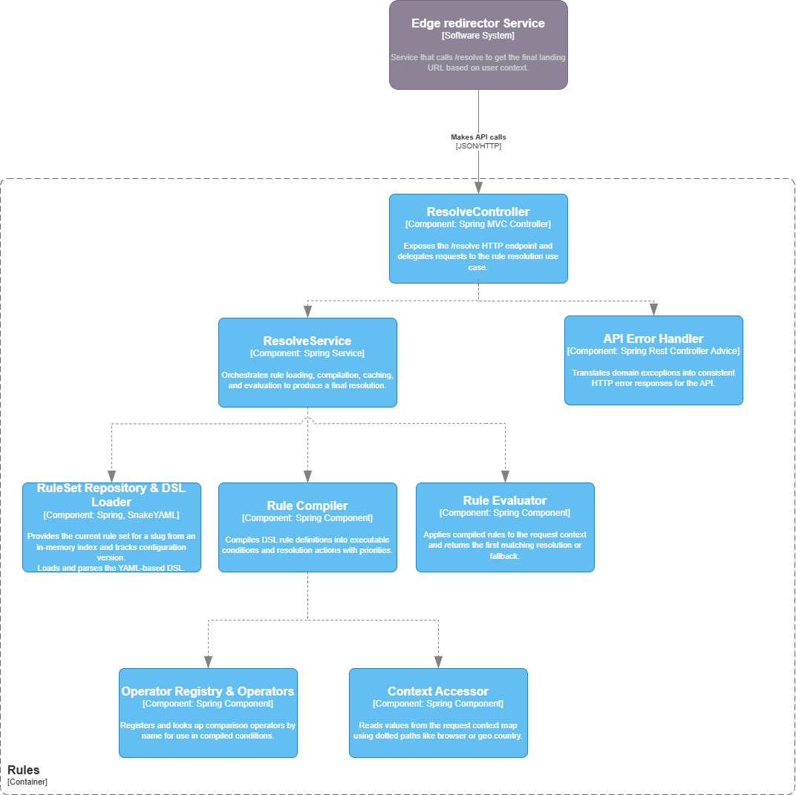

# Smart Links — Rules Service

## Архитектура



Rules Service отвечает за выбор целевого landing-URL на основе YAML-DSL и контекста пользователя.  
Edge-сервис вызывает `POST /resolve`, передавая `slug` и карту атрибутов. Rules Service загружает правила из `rules.yaml`, компилирует их в исполняемое представление, кэширует наборы правил по slug и версии конфигурации, а затем вычисляет `Resolution`.

Основные компоненты:
- **ResolveController** — REST-контроллер `POST /resolve`, принимает `ResolveRequest` и возвращает `Resolution` в JSON.
- **ResolveService (ResolveUseCase)** — оркестрирует загрузку, компиляцию, версионный кэш и выполнение правил.
- **RuleSetRepository (InMemoryRuleSetRepository)** — in-memory хранилище `RuleSet` по slug, с поддержкой версии конфигурации.
- **DslLoader (ClasspathYamlLoader)** — загружает и парсит YAML-конфиг (`rules.yaml`) в DSL-модель (`DslRoot`, `RuleSet`, `RuleDef`, `CondDef`, `ThenDef`).
- **RuleCompiler (DefaultRuleCompiler)** — компилирует DSL-условия в исполняемые предикаты и действия.
- **OperatorRegistry & Operators (eq, in, between, regex)** — реестр операторов и их реализации.
- **Accessor (DottedPathAccessor)** — читает значения из контекста по “точечным” путям (`browser`, `device`, `geo.country`).
- **RuleEvaluator (DefaultRuleEvaluator)** — применяет скомпилированные правила по приоритету и возвращает первое сработавшее либо fallback-URL.
- **ErrorHandler** — маппит доменные исключения в HTTP-ошибки (`400` и `500`).

## Кастомный DSL

Rules Service использует **кастомный YAML-DSL** для описания правил без изменения Java-кода.

Каждый `slug` в `rules.yaml` определяет:
- `defaultUrl` — URL по умолчанию,
- `rules[]` — набор правил:
  - `priority` — приоритет,
  - `when` — логическое условие (`all`, `any`, `not`, предикаты),
  - `then` — действие (`url`, `ttl`, `reason`).

Условия строятся из:
- логических комбинаций: `all`, `any`, `not`,
- предикатов: `{ path, operator, value }`,
- операторов: `eq`, `in`, `between` (по времени), `regex`.

## Паттерны проектирования

- **Composite / Specification для условий**  
  - Иерархия `CondDef` (`AllDef`, `AnyDef`, `NotDef`, `PredDef`) описывает дерево логических условий.  
  - `DefaultRuleCompiler` превращает это дерево в набор исполняемых `Condition`.  
  - Это реализует **Composite/Specification**: сложные правила строятся из простых без изменения ядра.

- **Strategy для операторов**  
  - Интерфейс `Operator` и реализации `EqOperator`, `InOperator`, `BetweenTimeOperator`, `RegexOperator` инкапсулируют разные способы сравнения.  
  - `DefaultOperatorRegistry` получает список операторов через DI и регистрирует их по имени.  
  - Добавление нового оператора не требует изменения компилятора (**OCP**, **DIP**).

- **Repository для наборов правил**  
  - `RuleSetRepository` абстрагирует источник конфигурации от бизнес-логики.  
  - `InMemoryRuleSetRepository` можно заменить на реализацию для БД или config-сервиса, не меняя `ResolveService`.

- **Factory-стиль компиляции**  
  - `RuleCompiler` выступает фабрикой: из `RuleSet` делает `CompiledRuleSet` — неизменяемую структуру, готовую к исполнению.  
  - Разделяются “описание” и “исполнение”, улучшается тестопригодность.

- **Версионный кэш**  
  - `ResolveService` кэширует скомпилированные наборы правил по паре (slug, version).  
  - При обновлении конфигурации изменяется версия и кэш автоматически инвалидируется, соблюдая **SRP** и **OCP**.

## Технологии

Rules Service использует:

- **Java 17**  
- **Spring Boot 3 (Web)** — Spring MVC / REST  
- **Spring Validation** — валидация входных DTO (при необходимости)  
- **SnakeYAML, Jackson Dataformat YAML** — парсинг YAML и маппинг в объекты  
- **Spring Boot Test, JUnit 5, Mockito** — тестирование контроллеров и доменной логики  
- **JaCoCo** — анализ покрытия тестами с порогом в %
- **Maven** — сборка и зависимости

## Как запустить сервис

Требования: JDK 17, Maven.

```bash
mvn clean package
mvn spring-boot:run